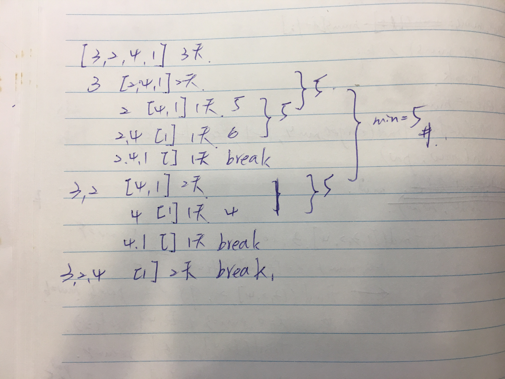

## Approach 1

一開始想到的是暴力解，去窮舉所有載貨的組合，取最小可行載貨數量。
主要將問題拆解成較小的問題，從 2 天開始嘗試，然後 3, 4, ...。
以3 天的為例，首先逐步固定貨物，剩下的貨物 2 天載完。
不過在第 12 筆測資發生Time Limit Exceeded

<div style="margin:30px 0px"></div>

```python
class Solution1:
    def shipWithinDays(self, weights, days):
        # tw: total weight
        tw = sum(weights)
        return self.find_min_weight(weights, days, tw)

    def find_min_weight(self, weights, days, total_weight):
        # 貨物全載
        if days == 1:
            return total_weight

        # mw: min weight
        left, mw = (0, None)
        for i, weight in enumerate(weights):
            # nw: next weights
            nw = weights[i+1:]
            # 下一回合限制天數大於貨物數量，直接 break
            if len(nw) < days-1:
                break

            # 已上船
            left += weight

            # cw: current weight
            cw = max(left, self.find_min_weight(nw, days-1, total_weight-left))
            mw = min(mw, cw) if mw else cw
        return mw
```

## Approach 2
可以先確認貨物是否在給定某 capacity 下能否載送 is_capable，
然後從最小開始試，是到第一個可以載的就是 minimum capacity。
最小要多小？至少可以裝單獨一個貨物！為 max(weights)，
最大呢？載送全部貨物！為 sum(weights)。
但第 6 筆測資時 Time Limit Exceeded🥲。

```python
class Solution2:
    def shipWithinDays(self, weights, days):

        def is_capable(weights, days, capacity):
            curr_weight = 0
            for w in weights:
                # 如果新貨物上船卻超載，則讓船開出去，減 1 天，新貨物上新船
                if curr_weight + w > capacity:
                    days -= 1
                    curr_weight = w
                else:
                    curr_weight += w
            # 全部跑完後，最少還要 1 天載剩下的
            return True if days > 0 else False

        max_weight = max(weights)
        total_weight = sum(weights)

        for capacity in range(max_weight, total_weight+1):
            if is_capable(weights, days, capacity):
                return capacity
```

## Approach 3
延續 Approach 2 重寫 is_capable，
以限制天數跟 capacity 方式，只要超過限制天數直接 return。
但第 62 筆測資時 Time Limit Exceeded🥲。

```python
class Solution3:
    def shipWithinDays(self, weights, days):

        def is_capable(weights, limit_days, capacity):
            days = 1
            curr_weight = 0
            for w in weights:
                if curr_weight + w > capacity:
                    days += 1
                    if days > limit_days:
                        return False
                    curr_weight = 0
                curr_weight += w
            return True

        max_weight = max(weights)
        total_weight = sum(weights)

        for capacity in range(max_weight, total_weight+1):
            if is_capable(weights, days, capacity):
                return capacity
```

## Approach 4
延續 Approach 3，
在找尋特定 capacity is_capable 時，
可以使用 binary search 加速。
如果 is_capable == True, right = mid
如果 is_capable == False, left = mid + 1
終於通過😀

```python
class Solution4:
    def shipWithinDays(self, weights, days):

        def is_capable(weights, limit_days, capacity):
            days = 1
            curr_weight = 0
            for w in weights:
                if curr_weight + w > capacity:a
                    days += 1
                    if days > limit_days:
                        return False
                    curr_weight = 0
                curr_weight += w
            return True

        left, right = max(weights), sum(weights)

        while left < right:
            mid = (left + right) // 2
            if is_capable(weights, days, mid):
                right = mid
            else:
                left = mid + 1
        return left
```