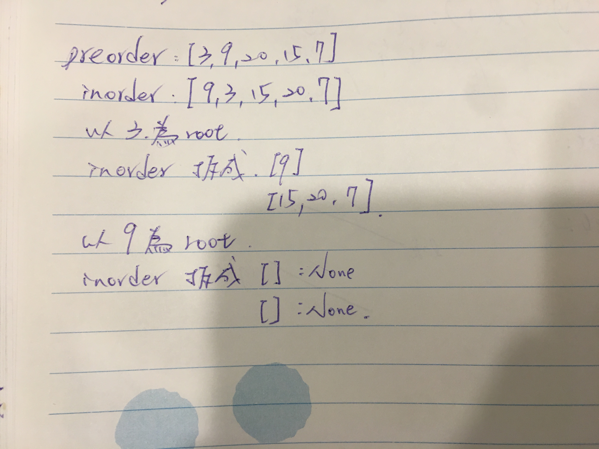

## Approach 1

preorder 的 node 就是 root，然後觀察 inorder 同樣值的左右兩邊就是 tree 的 left 跟 right nodes。

<div style="margin:30px 0px"></div>

* 從 preorder 取出第 1 個數字當作 root
* 利用該數字將 inorder 切成左右兩邊 `get_position(inorder, target)`
* 將 inorder 左邊及相同長度的 preorder 傳入 buildTree 造出左側的 tree。右邊也是一樣。


```python
class Solution1:
    def buildTree(self, preorder, inorder):
        if not preorder:
            return
        val = preorder[0]
        root = TreeNode(val)
        pos = self.__get_position(nums=inorder, target=val)
        root.left = self.buildTree(preorder[1:pos+1], inorder[0:pos])
        root.right = self.buildTree(preorder[pos+1:], inorder[pos+1:])
        return root

    def __get_position(self, nums, target):
        for i, num in enumerate(nums):
            if num == target:
                return i

        # 題目的 binary tree nums 是 tree node 的編號，非 val
        # 因此 inorder nums 並非代表實際的 val 順序。
        # start, end = 0, len(nums)-1

        # while start <= end:
        #     mid = (start + end) // 2
        #     if nums[mid] == target:
        #         return mid

        #     if nums[mid] > target:
        #         end = mid - 1
        #     else:
        #         start = mid + 1
```

## Approach 2

改進 Approach 1
針對時間， `__get_position` ，每次都要 iterate inorder 1 次，可以使用 hash map 當作 cache 增加取得 index 的效率
針對空間，每次 recurse 就得一直切 nums，佔記憶體空間大，可以使用 pointer，指向 left 跟 right。

時間複雜度: O(n)
    * 建立 hash map O(n)
    * 執行 n 次 create_node ，建立 n 個 node O(n)
空間複雜度 O(n)
    * 建立 hash map O(n)
    * callstack 最壞情況當 tree 為一直線時，O(n)，平衡 tree 則為 O(logn)
    
```python
class Soulution2:
    def buildTree(self, preorder, inorder):
        index = 0
        index_cache = {val: i for i, val in enumerate(inorder)}

        def create_node(left, right):
            nonlocal index

            if left > right:
                return None

            val = preorder[index]
            index += 1

            root = TreeNode(val)
            pos = index_cache[val]
            root.left = create_node(left, pos-1)
            root.right = create_node(pos+1, right)
            return root

        return create_node(0, len(inorder)-1)
```
