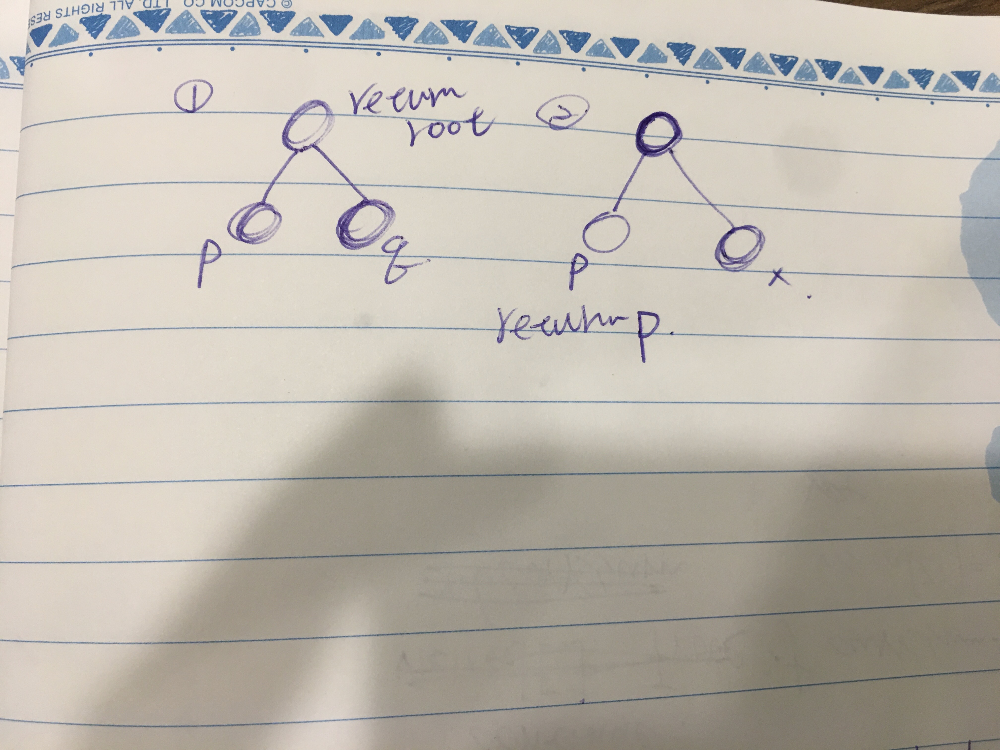

## Approach 1

暴力解

- 找兩個節點，並記錄路徑
- 比較路徑長短
- 依序從後開始判斷，短的路徑元素是否在長的路徑裡
    - 若是就找到了

速度太慢完全不推

```python
class Solution1:
    def lowestCommonAncestor(self, root, p, q):
        p_path = self.find_path(root, p)
        q_path = self.find_path(root, q)

        if len(p_path) <= len(q_path):
            short_path_list, long_path_set = p_path, set(q_path)
        else:
            short_path_list, long_path_set = q_path, set(p_path)

        for i in range(-1, -len(short_path_list)-1, -1):
            if short_path_list[i] in long_path_set:
                return short_path_list[i]

    def dfs(self, path, target, res):
        curr = path[-1]
        if curr.val == target.val:
            res.extend(path)
        if curr.left and not res:
            self.dfs(path+[curr.left], target, res)
        if curr.right and not res:
            self.dfs(path+[curr.right], target, res)
        return res

    def find_path(self, root, target):
        res = []
        self.dfs([root], target, res)
        return res
```

#### 時間複雜度
`find_path` $\mathcal{O}({n})$ `for ... if short in long: ...` $\mathcal{O}({n}^{2})$，為 $\mathcal{O}({n}^{2})$。
#### 空間複雜度
$\mathcal{O}({n}^{2})$。

## Approach 2

focus on one node!
node 的 state 要如何變化？
兩種狀況

- 左右子樹分別找到 p and q，root 就是最低共同祖先，return root
- 僅左或右子樹找到單ㄧ p or q，那麼 p or q 即是 solution，return p or q

<div style="margin:30px 0px"></div>

```python
class Solution2:
    def lowestCommonAncestor(self, root, p, q):
        if not root:
            return
        if root.val in (p.val, q.val):
            return root

        left = self.lowestCommonAncestor(root.left, p, q)
        right = self.lowestCommonAncestor(root.right, p, q)
        if left and right:
            return root

        return left or right
```

#### 時間複雜度:
最壞情況要搜尋所有 node，每個 node 僅作 $\mathcal{O}{1}$ 的運算，綜上為 $\mathcal{O}{n}$。
#### 空間複雜度:
最壞情況 function call stack 是整棵樹的高度，$\mathcal{O}{n}$。

#### reference:
https://www.youtube.com/watch?v=py3R23aAPCA
    