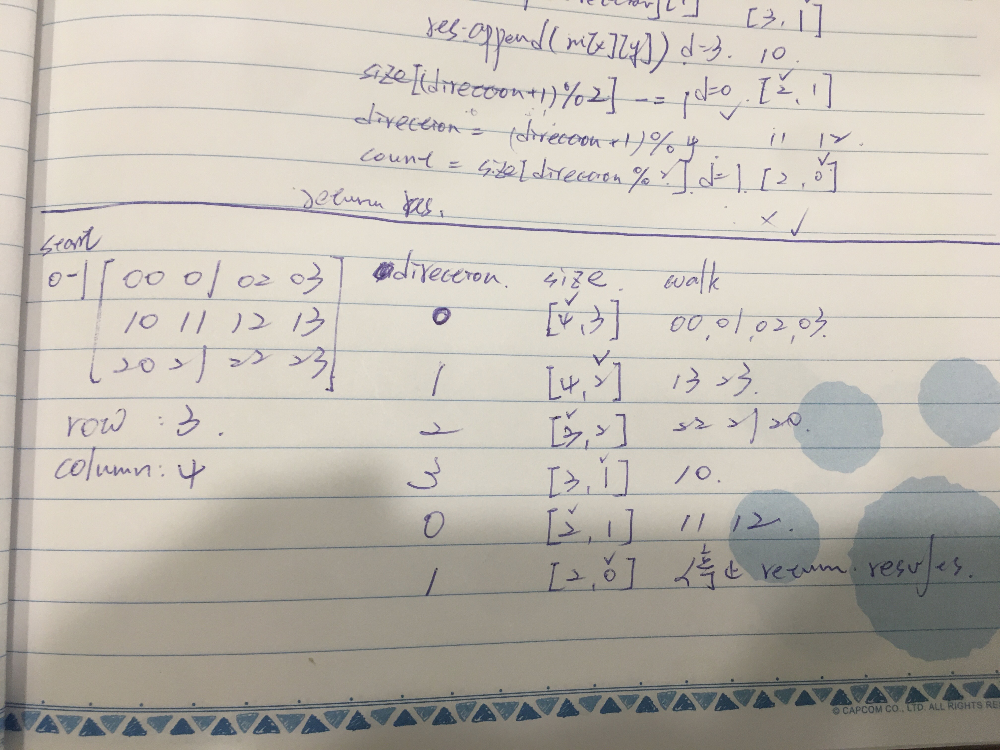

## Approach 1

Recursion

```ptython
matrix = [[1, 2, 3, 4], [5, 6, 7, 8], [9, 10, 11, 12], [13, 14, 15, 16]]
```
矩陣表示：
$\begin{bmatrix}
  1 & 2 & 3 & 4 \\
  5 & 6 & 7 & 8 \\
  9 & 10 & 11 & 12 \\
  13 & 14 & 15 & 16
\end{bmatrix}$

矩陣對應的位置：
$\begin{bmatrix}
  00 & 01 & 02 & 03 \\
  10 & 11 & 12 & 13 \\
  20 & 21 & 22 & 23 \\
  30 & 31 & 32 & 33
\end{bmatrix}$


觀察規律，走的順序是第 1 圈`右下左上`，第 2 圈`右下左上`，依序繞至中心。初始想法：
* 用 set 計錄走過的軌跡，不能用數字，因為會重複，所以紀錄位置 e.g. `00`
* 從 matrix 位置 `00` 開始，然後固定 row 往右走到底 `01`, `02`,`03`，
    檢查位置的 set 如果已走過則 `break`，最後記錄 column 位置 `3` 
* 固定上一步記錄的 column，然後往下走 `13`, `23`, `33`。最後記錄位置 row `3`
* 固定上一步記錄的 row， 然後往左走 `32`, `31`, `30`。最後記錄位置 column `0`
* 固定上一步記錄的 column， 然後往上走 `20`, `10`, `00`。
* 因為 `00` 走過了，`break` 記錄 row 位置 `1`
* 遞迴上述`右下左上`，直到 results 的長度等於矩陣 size `m*n` 即終止。

```python
class Solution1:
    def spiralOrder(self, matrix):
        # 從第一個開始，先加入 results 及座標，螺旋時都只會判斷下一個
        first = matrix[0][0]
        results = [first]
        pathed_set = set()
        pathed_set.add('00')

        m = len(matrix)
        n = len(matrix[0])
        count = m * n

        def spiraled(row, column):
            # results 已經包含矩陣所有數字，終止。
            if count == len(results):
                return

            # 右，colum+1 就是從下一個開始到 column 數量
            for j in range(column+1, n):
                num = matrix[row][j]
                spot = f'{row}{j}'
                if spot in pathed_set:
                    break
                pathed_set.add(spot)
                results.append(num)
                # 記錄目前矩陣座標
                column = j

            # 下 row+1 到 row 數量
            for i in range(row+1, m):
                num = matrix[i][column]
                spot = f'{i}{column}'
                if spot in pathed_set:
                    break
                pathed_set.add(spot)
                results.append(num)
                row = i

            # 左 column-1 到 0，倒著數回來
            for j in range(column-1, 0-1, -1):
                num = matrix[row][j]
                spot = f'{row}{j}'
                if spot in pathed_set:
                    break
                pathed_set.add(spot)
                results.append(num)
                column = j

            # 上 row-1 到 0，倒著數回來
            for i in range(row-1, 0-1, -1):
                num = matrix[i][column]
                spot = f'{i}{column}'
                if spot in pathed_set:
                    break
                pathed_set.add(spot)
                results.append(num)
                row = i

            # 下一輪
            spiraled(row, column)

        spiraled(0, 0)
        return results
```

#### 時間複雜度
依序走過矩陣的每個節點 $\mathcal{O}({m}*{n})$
#### 空間複雜度
新增一個 set 記錄軌跡，$\mathcal{O}({m}*{n})$），在考慮結果的 list $\mathcal{O}({m}*{n})$），最終空間複雜度依舊是$\mathcal{O}({m}*{n})$

## Approach 2

Iteration

每走過一個方向，相對應的 row 或 column 即 -1，設下圍籬，然後根據 step 一步一步走。
    
```python
class Solution2:
    def spiralOrder(self, matrix):
        res = []
        # size = [column, row]
        # 一開始要走往右水平的，走幾步看 column
        size = [len(matrix[0]), len(matrix)]

        # 右下左上的前進速度
        speeds = [[0, 1], [1, 0], [0, -1], [-1, 0]]

        # 首要方向
        direction = 0

        # 從 0 -1 開始走
        (x, y) = (0, -1)
        count = size[direction % 2]
        while count > 0:
            for _ in range(count):
                x += speeds[direction][0]
                y += speeds[direction][1]
                res.append(matrix[x][y])

            # 走完水平，column 數 - 1
            size[(direction + 1) % 2] -= 1
            # 方向轉換
            direction = (direction + 1) % 4
            count = size[direction % 2]
        return res
```

示意圖
<div style="margin:30px 0px"></div>

#### 時間複雜度
依序走過矩陣的每個節點 $\mathcal{O}({m}*{n})$
#### 空間複雜度
不考慮結果的話為 $\mathcal{O}({1})$，考慮結果的 list $\mathcal{O}({m}*{n})$。
