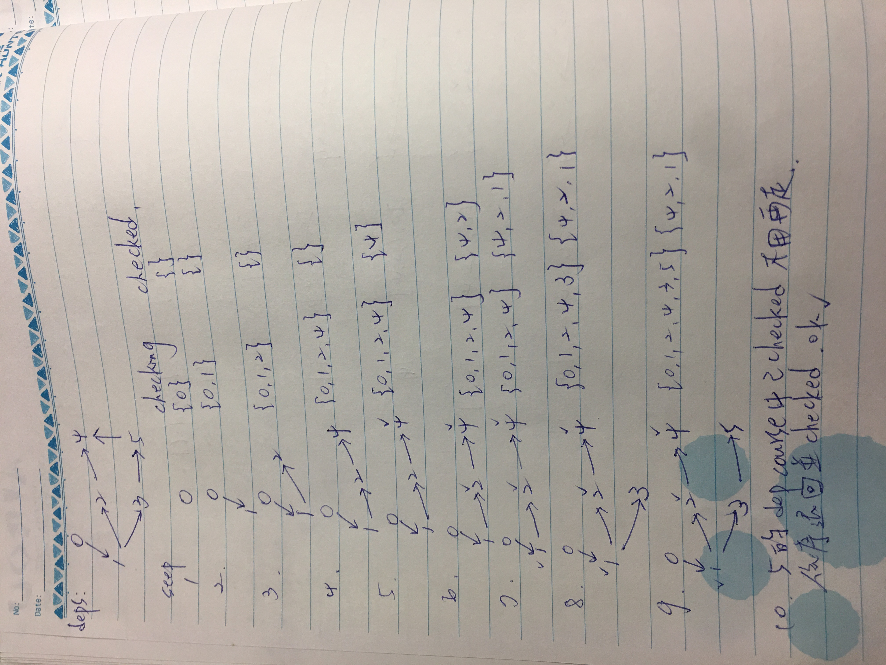
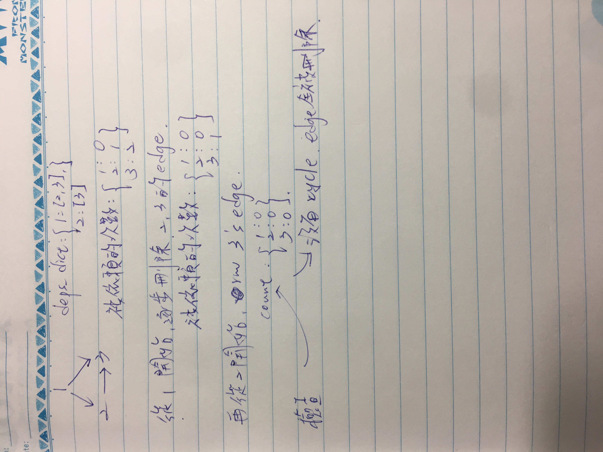

## Approach 2

DFS
主要依序從每個 node 往下遞迴地走，並記錄經過的 node，如果走過了代表互相依賴，直到最後一個 node，再依序退回並加入 checked，下一回就不用再走了。

steps:
<div style="margin:30px 0px"></div>

* 用 deps_dict 紀錄依賴關係
* iterate 每個 node，create checking 紀錄走過的點
    * if node in checked:
        走過了，return True
    * if node not in deps_dict:
        代表到底了，開始加入 checked，return True
    * if node in checking:
        又走回之前的 node，return False
    * iterate node 的 deps 持續往下走遞迴

```python
class Solution_2:
    def canFinish(self, numCourses, prerequisites):
        checked = set()
        deps_dict = {}
        for target, need in prerequisites:
            if target in deps_dict:
                deps_dict[target].append(need)
            else:
                deps_dict[target] = [need]

        checking = set()
        for target in range(numCourses):
            checking.clear()
            if not self.dfs(target, deps_dict, checking, checked):
                return False
        return True

    def dfs(self, target, deps_dict, checking, checked):
        # 已走過，無需再走
        if target in checked:
            return True
        # 沒有先修課
        if target not in deps_dict:
            checked.add(target)
            return True
        # 還沒 checked 就又走回頭路
        if target in checking:
            return False

        checking.add(target)
        for dep_course in deps_dict[target]:
            if not self.dfs(dep_course, deps_dict, checking, checked):
                return False
        # 紀錄已經走進去的點，下次就無需再走一次了。
        checked.add(target)
        return True
```

## Approach 3

BFS
topological sort(queue)

steps:
<div style="margin:30px 0px"></div>


* 除了 deps_dict，並計算被依賴 node 的次數。
* 用 queue 紀錄沒有被依賴的 node 並從第一個開始，持續把 edge 刪除。
* 有刪不掉的 edge 代表存在 cycle

```python
class Solution_3:
    def canFinish(self, numCourses, prerequisites):
        # deps == dependences, deped == depended
        deps = [[] for _ in range(numCourses)]
        deped_count = [0 for _ in range(numCourses)]

        # 紀錄被依賴的次數 edge
        for target, need in prerequisites:
            deps[target].append(need)
            deped_count[need] += 1

        # 從沒有被依賴的節點開始
        queue = []
        for course, count in enumerate(deped_count):
            if count == 0:
                queue.append(course)

        while queue:
            target = queue.pop(0)
            for dep in deps[target]:
                deped_count[dep] -= 1
                if deped_count[dep] == 0:
                    queue.append(dep)

        # 有刪不掉的 edge 代表存在 cycle
        for count in deped_count:
            if count != 0:
                return False
        return True
```