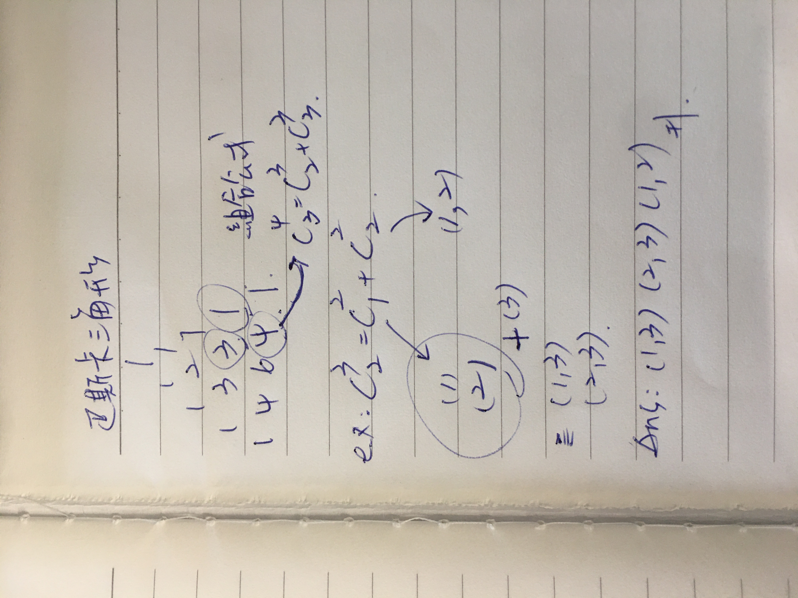

## 6 tree
* [94 Binary Tree Inorder Traversal](./6_stack-queue-tree/94.%20Binary%20Tree%20Inorder%20Traversal/index.py)
    inorder traversal 使用 iterative ! 有點難想
    ref: Approach2 Iterate

* [100 Same Tree](./6_stack-queue-tree/100.%20Same%20Tree/index.py)
    * 回傳物件要一致
        在 depth == 0 時，不能只有 return
        否則當 tree 只有 root １節點時會 runtime error
    * 更好的方法：遞迴每個節點就好！！看 solution 才知道...

* [1382 Balance a Binary Search Tree](./6_stack-queue-tree/1382.%20Balance%20a%20Binary%20Search%20Tree/index.py)
    * 一開始的方式不穩定，是錯誤的
      對每個節點算出左右子樹高度差，
      然後辨別型態，再 rotate，
      結果發現 root 不平衡。
    * 重新排序中序遍歷，再新增 balance tree!

* [111. Minimum Depth of Binary Tree](./6_stack-queue-tree/111.%20Minimum%20Depth%20of%20Binary%20Tree/index.py)
    1. Approach 2 Recursion 深度優先 優化！

## 7 recursion
* [78. Subsets](./7_recursion/78.%20Subsets/index.py)
    * Approach 1 iteration
        * 構造 power set 有一套固定的思維, 從空集合開始, 選擇包含某個元素或者不包含, 每次選擇會增加 2 種可能, 因此會讓set 的數目不斷乘2 
    * Approach 2 recursion
        * dfs 記錄走過的路徑
    * Approach 3 backtracking
        * 球池不斷丟球 > 判斷符合數量 > 取球
        * 時間複雜度:
            不好估算，可以取大概即可  
            

* [236. Lowest Common Ancestor of a Binary Tree](./7_recursion/236.%20Lowest%20Common%20Ancestor%20of%20a%20Binary%20Tree/index.py)
    * Approach 1 recursion
        dfs 想很久...
        要傳進一個 res 當作找到路徑的結果
        這樣判斷才不會找到又繼續跑

* [124. Binary Tree Maximum Path Sum](./7_recursion/124.%20Binary%20Tree%20Maximum%20Path%20Sum/index.py)
    * Approach 1 recursion
        模式很難辨識...
        要從最少3個節點開始想
        遞迴到最底層回傳 path
        紀錄可能單邊出現的最大值

* [77. Combinations](./7_recursion/77.%20Combinations/index.py)
    * Approach 1 backtracking 
        [時間複雜度估算參考影片](https://youtu.be/q0s6m7AiM7o?t=288)
    * Approach 2 組合公式
        * 
        * [公式複習](https://academy.snapask.com/zh-tw/post/C%E7%9A%84%E7%AE%97%E6%B3%95-55a915a257cf)
    
* [40. Combination Sum II](./7_recursion/40.%20Combination%20Sum%20II/index.py)
    * Approach 1 backtracking
        不算重複的話，要判斷當前元素是否等於前一個元素，但會連第一組也被排除，所以利用迴圈 i > 0 來達成。
        
* [113. Path Sum II](./7_recursion/113.%20Path%20Sum%20II/index.py)
    * Approach 1 dfs
        原本多了加總大於目標值即 return 的終止條件，但題目有包含負數，
        因此得完全跑完至 leaf node 才能判斷。
    * Approach 2 iteration using queue
        把所有節點都算出需要的內容
        放進 queue 裡再一個一個取出判斷
        whu use queue?
        因為要由上往下加走過的路徑
        